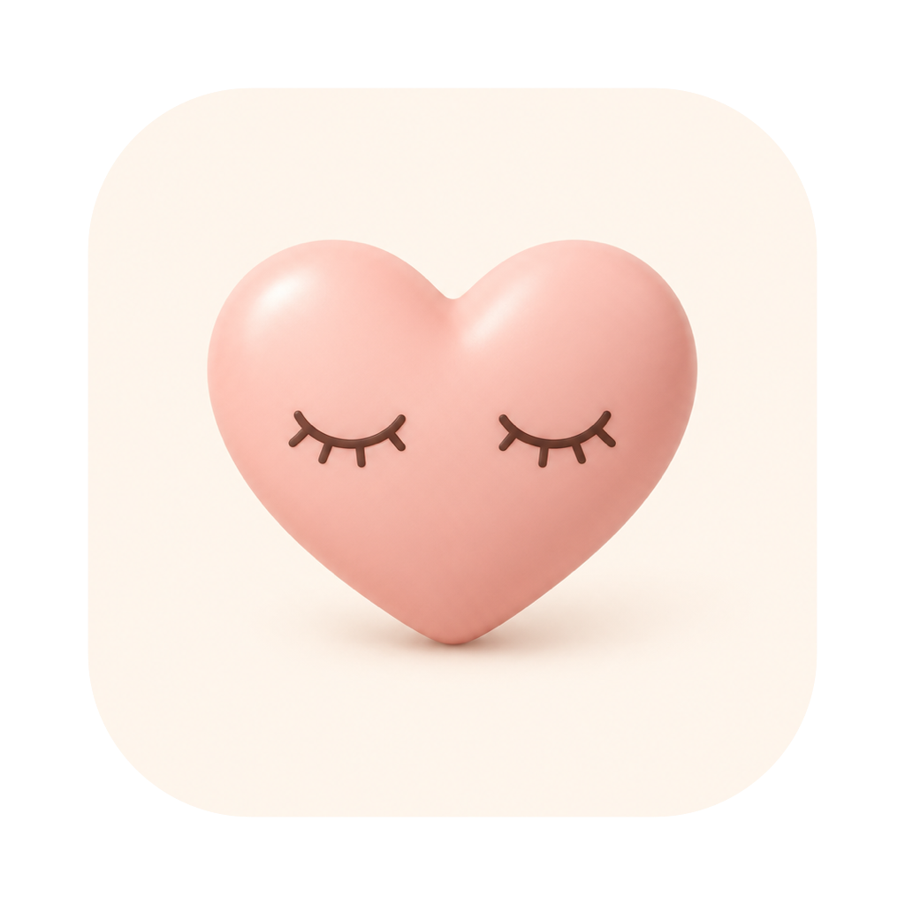

<div align="center">



# HeartEyes 😍

**A tiny native macOS menu-bar app for the 20‑20‑20 rule.**
Every 20 minutes, look at something 20 feet away for 20 seconds — HeartEyes gently
covers your screens with a GIF of your choice and a 20‑second countdown, then fades away.

[](https://github.com/AshCatchEmAll/HeartEyes/actions/workflows/ci.yml)
[](LICENSE)
[](https://www.apple.com/macos/)
[](https://github.com/AshCatchEmAll/HeartEyes/stargazers)

[Website](https://hearteyes.app) · [Report a bug](https://github.com/AshCatchEmAll/HeartEyes/issues) · [Request a feature](https://github.com/AshCatchEmAll/HeartEyes/issues) · [Star it ⭐](https://github.com/AshCatchEmAll/HeartEyes/stargazers)

</div>

<p align="center">
  
</p>

## Why HeartEyes

Staring at a screen all day tires your eyes. Optometrists recommend the
**20‑20‑20 rule** — every 20 minutes, look 20 feet away for 20 seconds — to ease
digital eye strain. HeartEyes keeps that rhythm for you, and makes the break
something you'll actually enjoy instead of dismiss.

- 🕒 **The 20‑20‑20 rule, automated** — a countdown lives in your menu bar.
- 🖼️ **Your GIF, full screen** — pick any local GIF or paste a Giphy/Tenor link.
- 🖥️ **Every display** — the overlay sits above full‑screen apps and the menu bar.
- 👁️ **Gentle blink reminders** — optional, wordless nudges from the menu bar or a whole‑screen eyelid.
- 🎥 **Smart auto‑pause** — holds breaks during calls and full‑screen video, and skips one when you've stepped away.
- 📊 **Weekly reflection** — a private *This week…* look at your rest, computed on your Mac.
- 🔒 **Private & offline** — no account, no telemetry, no cloud, no camera. Everything stays on your Mac.
- 🪶 **Tiny & native** — dependency‑free Swift (AppKit). Universal binary, macOS 13+.
- 💙 **Free & open source, forever** — MIT licensed.

## Install

### Build from source

Requires macOS 13+ and the Xcode command‑line tools (`xcode-select --install`).

```bash
git clone https://github.com/AshCatchEmAll/HeartEyes.git
cd HeartEyes
./build.sh
open build/HeartEyes.app
```

Install it permanently:

```bash
cp -R build/HeartEyes.app /Applications/
```

There's no Dock icon — look for the heart mark and its **`20:00`** countdown in your
menu bar.

> **A one‑click, notarized download and a Homebrew cask are on the roadmap** —
> ⭐ star the repo to help get there. Building from source (above) runs with **no
> Gatekeeper prompt**, since a locally built app isn't quarantined.

## Menu

- **This week…** — a private weekly reflection: your longest stretch without a break,
  how much of your screen time was rest, breaks taken vs. skipped, and time held during
  calls. On‑device and deletable — never a daily score.
- **Take a break now** (⌘B) — trigger a break immediately
- **Pause / Resume** (⌘P)
- **Break GIF…** — one window to pick what you see during breaks: drop a file on the
  preview, browse for one, or paste a **Giphy** / **Tenor** / `.gif` link. Share links
  resolve to the real image, download, and cache locally. If you've already copied a
  link or a GIF, it's offered to you in one click.
- **Work interval** — 10 / 20 / 30 / 45 / 60 min (plus a 1‑min test mode)
- **Break length** — 10 / 20 / 30 / 60 sec
- **Blink reminders** — off, or every 3 / 5 / 10 min, in four styles (Hearts, Sparkles,
  Dewdrops, Just the blink), shown from the menu bar or as a whole‑screen eyelid.
- **Hold breaks during calls & video** — smart auto‑pause; holds a break while a call
  or full‑screen video is going. On by default.
- **Count time away as a break** — skip a break when you've already been away from the
  keyboard. On by default.
- **Launch at login** — start HeartEyes automatically
- **Quit** (⌘Q)

During a break, press **Esc** (or click **Skip**) to end it early.

## Privacy

HeartEyes has **no account, no telemetry, and no cloud** — and **no camera** or special
permissions to grant. Your GIF, settings, and a 90‑day rest history all live on your Mac
(the history is deletable in one click). The only network request it ever makes is
downloading a GIF you explicitly paste in.

## Contributing

Issues and PRs are welcome — see [CONTRIBUTING.md](CONTRIBUTING.md) and our
[Code of Conduct](CODE_OF_CONDUCT.md). The whole app lives in
[`Sources/`](Sources/) — a handful of dependency‑free Swift files.

## ⭐ If it helped, star it

HeartEyes is free and open source, and always will be — there's nothing to buy and
nothing to subscribe to. A star is the only thing it ever asks for: it's how the next
person with aching eyes finds this repo, and it's the signal that tells me what to
build next.

- ⭐ **[Star HeartEyes](https://github.com/AshCatchEmAll/HeartEyes/stargazers)** — two seconds, costs nothing
- 🗣️ Send it to someone whose eyes are screaming by 5pm
- 🛠️ [Open an issue or a PR](https://github.com/AshCatchEmAll/HeartEyes/issues) — it's a handful of dependency‑free Swift files

## License

[MIT](LICENSE) © 2026 - AshCatchEmAll built with love for tired eyes.
